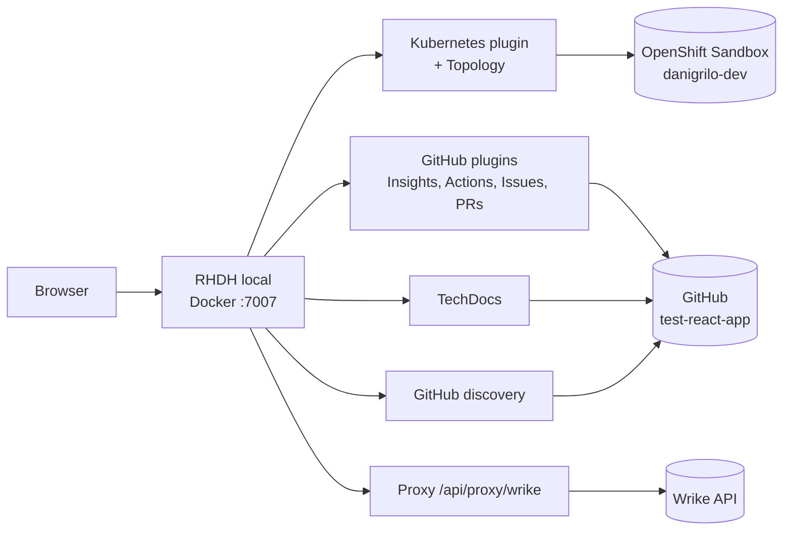

# Architecture

How the local Red Hat Developer Hub connects to everything it shows.

## Editing the diagram

Edit the `mermaid` block above and push. TechDocs re-renders it on the next build.

TechDocs strips JavaScript from pages, so Mermaid can't render in the browser here. Instead the `kroki` MkDocs plugin sends the block to kroki.io while the docs are built and embeds the resulting SVG.
