# Architecture

How the local Red Hat Developer Hub connects to everything it shows.

## Editing the diagram

TechDocs here can't render Mermaid directly, so the diagram is stored as an image.

1. Edit `docs/diagrams/architecture.mmd` (the Mermaid source).
2. Paste it into https://mermaid.live and check it looks right.
3. Export as SVG and replace `docs/diagrams/architecture.svg`.
